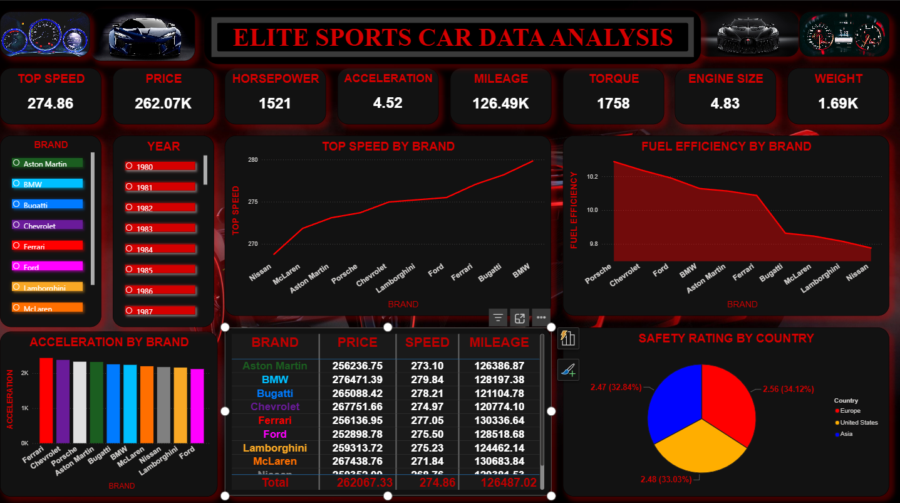
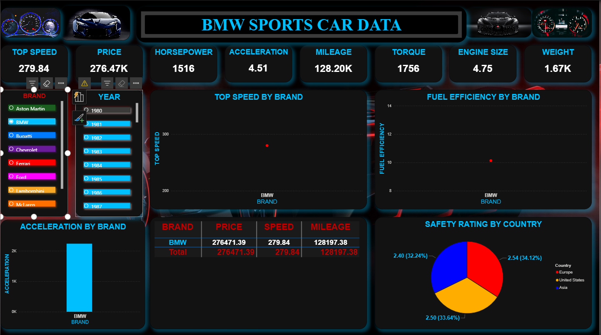

# 🚗 Sports Car Data Analysis Dashboard (Power BI)

💡 Designed a high-performance Power BI dashboard to analyze elite sports car data with interactive visuals and business insights.

---

## 📌 Overview
This project presents an interactive Power BI dashboard for analyzing elite sports car data across multiple brands. It provides deep insights into performance, pricing, efficiency, and safety using dynamic visualizations and filters.

---

## 🚀 Key Features
- 📊 KPI cards for Top Speed, Price, Horsepower, Mileage, Torque, Engine Size, and Weight  
- 📈 Brand-wise performance comparison  
- 📊 Fuel efficiency analysis  
- 🌍 Safety rating analysis by country  
- 🎯 Interactive filters (Brand & Year)  
- 🎨 Dark-themed modern UI dashboard  

---

## 🎨 Dashboard Highlights
- Clean and visually appealing dark UI  
- Real-time filtering using slicers  
- Multi-brand comparison  
- Easy-to-understand business insights  
- Interactive storytelling with visuals  

---

## 📊 Key Metrics Analyzed
- Top Speed  
- Price  
- Horsepower  
- Acceleration  
- Mileage  
- Torque  
- Engine Size  
- Weight  

---

## 🧠 Business Insights
- 🚀 BMW and Bugatti show highest top speeds  
- ⛽ Fuel efficiency decreases with increase in engine size  
- 🌍 European brands dominate safety ratings  
- ⚖️ High performance cars show trade-off between mileage and power  

---

## 📸 Dashboard Preview

  
  

---

## 🛠️ Tech Stack
- Power BI  
- DAX (Data Analysis Expressions)  
- Data Modeling  
- Data Visualization  

---

## 📂 Project Files
- `dashboard correct.pbix` – Power BI dashboard file  
- `SATYAM REPORT.pdf` – Detailed project report  
- `Elite Sports Cars in Data.csv` – Dataset used  

---

## ▶️ How to Use
1. Download the `.pbix` file  
2. Open in Power BI Desktop  
3. Explore dashboard using filters and slicers  

---

## 👨‍💻 Author
**Satyam Kumar Singh**  
BTech CSE | Python Developer | Data Analytics Enthusiast  

---

⭐ If you like this project, don't forget to star the repository!
